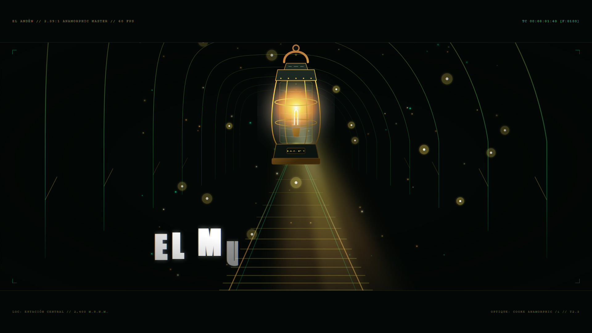
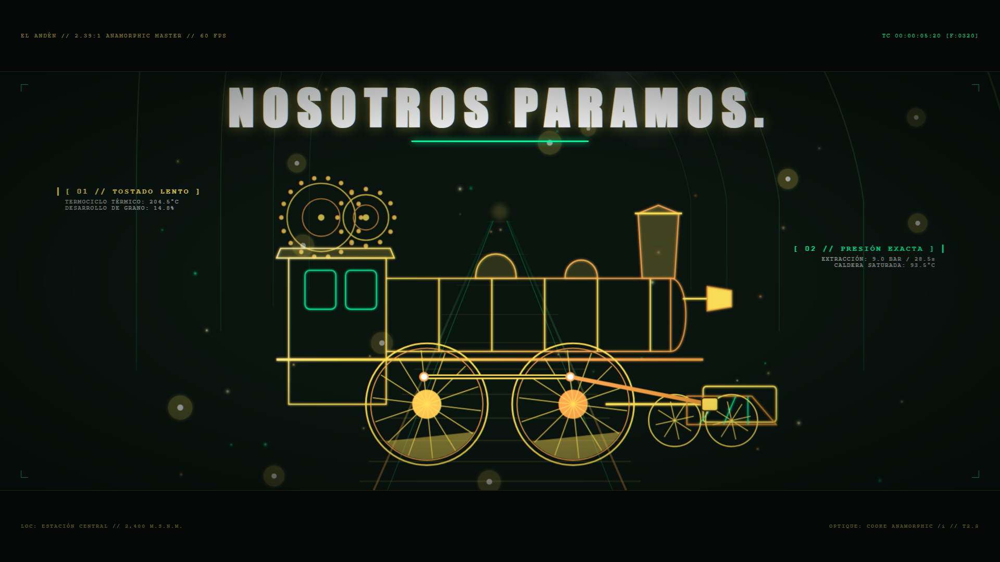
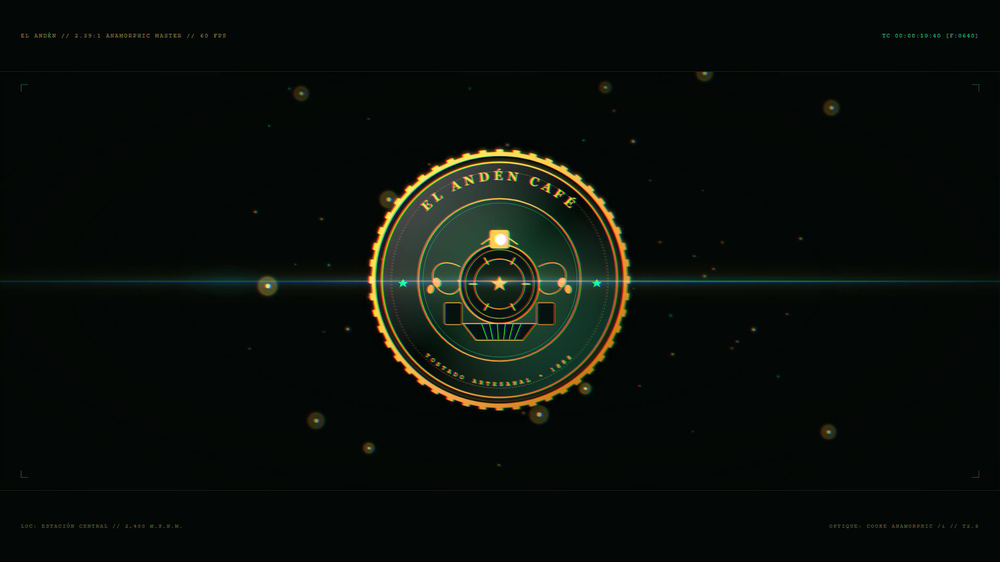
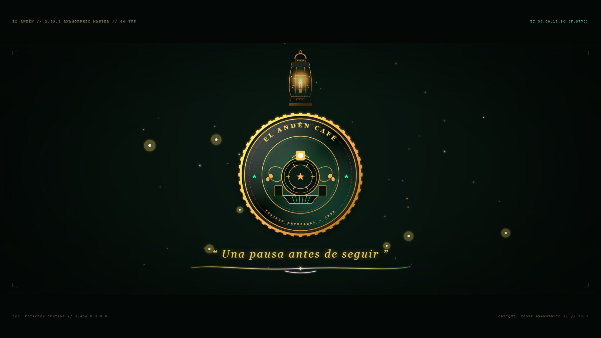

# EL ANDÉN CAFÉ: THE MIDNIGHT STEAM
### 15s Cinematic Brand Film • Remotion 4+ • React 18+ • TypeScript • 60 FPS • 4K Ready

[](https://pepenandosanchezcortes2012-hash.github.io/el-anden-cafe/)
[](https://www.remotion.dev/)
[](https://www.typescriptlang.org/)
[](https://en.wikipedia.org/wiki/Anamorphic_format)
[](https://www.remotion.dev/)

> **CONDICIÓN RADICAL:** El video es **100% silencioso**.  
> Para compensar la ausencia total de audio, el filme implementa una experiencia hipnótica mediante contrastes lumínicos extremos, ópticas anamórficas simuladas, físicas de partículas procedurales, cinemática mecánica y tipografía de precisión matemática.

---

## 🌐 Enlaces en Vivo y Presentaciones

- 🎬 **[Showcase Interactivo (Web Player & Galería)](https://pepenandosanchezcortes2012-hash.github.io/el-anden-cafe/)**
- 📺 **[Pitch Deck de Pantalla Completa (14 Diapositivas HTML)](https://pepenandosanchezcortes2012-hash.github.io/el-anden-cafe/deck.html)**
  - *Navegación con flechas del teclado `←` `→`, tecla `F` para pantalla completa y `Ctrl + P` para exportar a PDF directo.*
- 📊 **[Descargar Presentación en PowerPoint (.pptx)](https://pepenandosanchezcortes2012-hash.github.io/el-anden-cafe/EL_ANDEN_CAFE_Pitch.pptx)**

---

## 🎞️ Galería de Fotogramas Clave

| Acto I: La Ignición (f100) | Acto II: La Máquina (f320) |
| :---: | :---: |
|  |  |
| **Acto III: El Colapso (f640)** | **Acto IV: El Sello Inmortal (f770)** |
|  |  |

---

## 🎬 Coreografía Cuadro a Cuadro (900 Frames / 15.0 Segundos)

| Acto | Frames | Tiempo | Descripción Visual y Mecánica |
| :--- | :---: | :---: | :--- |
| **Acto I: La Ignición en la Penumbra** | `0 – 210` | `0 – 3.5 s` | Oscuridad absoluta. Chispa eléctrica en el farol, flash de exposición de 3 frames (f45–48). El farol victoriano revela los arcos del túnel en perspectiva de 1 punto de fuga (`perspective: 1200px`). Entrada carácter por carácter de *"EL MUNDO CORRE."* mediante spring mask; *"CORRE"* se desintegra en líneas de velocidad. |
| **Acto II: La Máquina y el Grano** | `210 – 480` | `3.5 – 8.0 s` | Efecto Vértigo (*Dolly Zoom*) combinando `scale` y `perspectiveOrigin`. Cinemática de biela-manivela en ruedas tractoras y engranajes girando a relaciones exactas. El humo de la locomotora transmuta a vapor denso de espresso vía `<feDisplacementMap>`. Tipografía *"NOSOTROS PARAMOS."* + HUD de precisión técnica (`[ 01 // TOSTADO LENTO ]`, `[ 02 // PRESIÓN EXACTA ]`, `[ 03 // ALTA MONTAÑA ]`). |
| **Acto III: El Colapso y la Síntesis** | `480 – 720` | `8.0 – 12.0 s` | Implosión gravitacional a gran velocidad hacia el centro con curva exponencial `bezier(0.7, 0, 0.84, 0)`. Onda de choque lumínica en el impacto (f535). Ensamblaje del imagotipo: el iris esmeralda se sella con el aro moleteado dorado (`-90° → 0°`). Grabado en relieve invertido en tiempo real. Destello anamórfico horizontal (*streak flare*) que barre el emblema de izquierda a derecha. |
| **Acto IV: El Sello Inmortal y Cierre** | `720 – 900` | `12.0 – 15.0 s` | El emblema de "EL ANDÉN CAFÉ" suspendido en el centro respira con pulso magnético armónico (`scale: 1.0` a `1.014`). Caligrafía viva de la frase insignia *"Una pausa antes de seguir"* trazada de izquierda a derecha mediante `strokeDashoffset`. La viñeta periférica consume los bordes y funde a negro absoluto en el frame 885. |

---

## 🔬 Motores Visuales y Físicas Procedurales

1. **Óptica Anamórfica & Aberración Cromática Espectral:**
   - Desfase dinámico de canales RGB de 2 a 4 píxeles durante las ondas de choque, aislado con filtros SVG `<feColorMatrix colorInterpolationFilters="sRGB">` y recombinado con `mix-blend-mode: screen`.
2. **Destello Anamórfico (*Streak Flare*):**
   - Haz horizontal de 1920px de luz polarizada con núcleo blanco, zafiro (`#00E5FF`) y halo dorado (`#FFE259`), barriendo transversalmente con aceleración `Easing.bezier(0.16, 1, 0.3, 1)`.
3. **Refracción de Calor y Vapor SVG:**
   - Filtro SVG procedimental con `<feTurbulence>` y `<feDisplacementMap>` animando `baseFrequency` respecto al frame para simular la perturbación térmica del vapor caliente.
4. **Campo de Polvo Dorado y Chispas:**
   - 80 partículas deterministas suspendidas en el haz cónico de luz del farol, calculadas con funciones pseudoaleatorias periódicas (`Math.sin`, `Math.cos`), garantizando reproducibilidad exacta entre renders.
5. **Arte 100% Vectorial Paramétrico:**
   - Todo el arte (farol Fresnel, locomotora, arcos de la estación, filigranas victorianas y sello heráldico) está embebido en SVG puro, escalando impecablemente a 4K UHD (3840×2160) sin artefactos de compresión ni pérdida de nitidez.

---

## 💻 Instalación y Ejecución Local

```bash
# 1. Clonar el repositorio
git clone https://github.com/pepenandosanchezcortes2012-hash/el-anden-cafe.git
cd el-anden-cafe

# 2. Instalar dependencias
npm install

# 3. Vista previa interactiva en Remotion Studio
npx remotion preview src/index.ts

# 4. Renderizar video final en MP4 (1080p Scope, 60 fps)
npx remotion render src/index.ts MainComposition out/el-anden-cafe.mp4 --concurrency=8

# 5. Renderizar master 4K Ultra-HD (3840×2160)
npx remotion render src/index.ts MainComposition-4K out/el-anden-cafe-4K.mp4 --concurrency=8
```

---

## 🎨 Paleta Cromática de Alto Contraste

| Muestra | Nombre | Hex | Rol en el Filme |
| :---: | :--- | :---: | :--- |
|  | **Carbón Abisal** | `#030705` | Fondo y vacío cósmico de la penumbra |
|  | **Bosque Nocturno** | `#0A140F` | Atmósfera y profundidad del túnel |
|  | **Oro Fundido** | `#FFE259` | Luz principal, filamentos y tipografía hero |
|  | **Ámbar Incandescente** | `#FFA751` | Halos térmicos y vapor de extracción |
|  | **Verde Esmeralda Neón** | `#00FFA3` | Acentos de advertencia, HUD y lente óptica |
|  | **Azul Zafiro** | `#00E5FF` | Núcleo de la dispersión anamórfica |

---

*“Una pausa antes de seguir.”*  
**El Andén Café // Estación Central · 2,400 M.S.N.M.**
